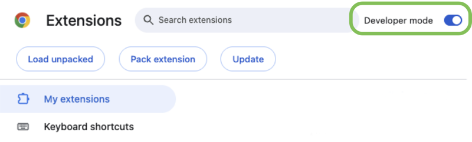
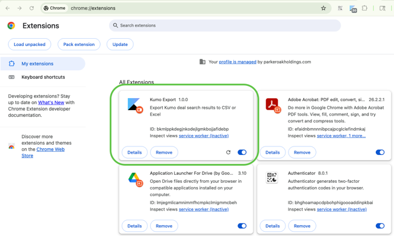
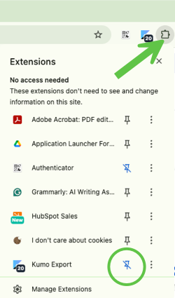
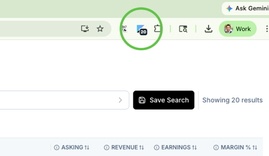
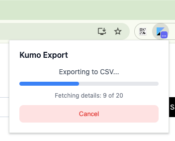
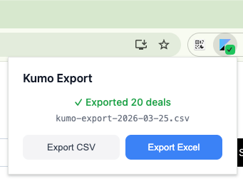

# Kumo Export — Installation Guide

## Install

1. Download `kumo-export.zip` and unzip it to a folder on your computer (e.g. `~/kumo-export`). **Don't delete this folder** — Chrome needs it to run the extension.

2. Open Chrome and go to `chrome://extensions`

3. Enable **Developer mode** using the toggle in the top-right corner.

4. Click **Load unpacked** and select the unzipped folder.

5. You should see Kumo Export in your extensions list.

6. The Kumo Export icon should now appear in your Chrome toolbar. If you don't see it, click the puzzle piece icon in the toolbar and pin **Kumo Export**.

## Usage

1. Go to [app.withkumo.com](https://app.withkumo.com) and log in.

2. Navigate to the **Search Deals** page and apply any filters you want. The badge on the extension icon updates to show the number of matching deals.

3. Click the **Kumo Export** icon in the toolbar — it will show the number of deals matching your current filters. Click **Export CSV** or **Export Excel** to download.

4. The export runs in the background — you can close the popup and it will continue. Reopen the popup to check progress.

5. When the export completes, you'll see a confirmation with the filename.

## Notes

- Chrome may show a "Disable developer mode extensions" banner on startup. Just dismiss it — the extension will continue to work.
- If the extension stops detecting your searches, try refreshing the Kumo page.
- If your Kumo session expires during an export, you'll see a session expired message. Just log back in to Kumo and try again.

## Updating

If you receive a new version of `kumo-export.zip`:

1. Unzip it and replace the contents of your existing folder.
2. Go to `chrome://extensions` and click the reload button (↻) on the Kumo Export card.
