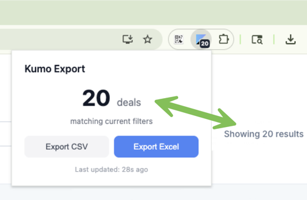

# Kumo Export

Chrome extension that exports deal search results from [Kumo](https://app.withkumo.com) to CSV or Excel.



## Features

- Automatically detects your current search filters and deal count on the Kumo deals page
- Exports all matching deals (not just the current page) to CSV or Excel (XLSX)
- Includes deal details like business summary, highlights, and additional information fetched from the detail API
- Background export with progress tracking — close the popup and it keeps running
- Copy your Kumo auth token to clipboard from the popup
- Badge on the toolbar icon shows the current matching deal count

## Exported Columns

Business Name, Location, Asking Price, Revenue, Earnings (EBITDA/SDE), Margin %, Multiple, Industry, Date Added, Kumo Link, Summary, Top Highlights, Additional Information

## Development

### Prerequisites

- Node.js
- Chrome with Developer mode enabled

### Setup

```sh
npm install
```

### Build

```sh
npm run build     # one-time build
npm run watch     # rebuild on changes
```

This bundles `background.js` (and its `lib/` imports) into `dist/background.bundle.js` via esbuild. Other scripts (`content.js`, `page-script.js`, `popup.js`) are loaded directly by the manifest and don't need building.

### Load in Chrome

1. Go to `chrome://extensions`
2. Enable **Developer mode**
3. Click **Load unpacked** and select the project root folder
4. After code changes, run the build and click the reload button on the extension card

### Configuration

Rate limiting and timeout values are in `lib/config.js`:

| Constant | Default | Purpose |
|---|---|---|
| `DETAIL_CONCURRENCY` | 5 | Parallel detail API fetches |
| `DETAIL_DELAY_MS` | 0 | Delay between detail batches |
| `SEARCH_DELAY_MS` | 0 | Delay between search page fetches |
| `REQUEST_TIMEOUT_MS` | 30000 | Per-request timeout |

## How It Works

The extension uses three execution contexts that communicate via message passing:

1. **Page script** (`page-script.js`, MAIN world) — intercepts `fetch` calls on `app.withkumo.com` to capture search filters and results metadata, and reads the auth token from `localStorage`.

2. **Content script** (`content.js`, isolated world) — bridges the page script and extension APIs. Receives `window.postMessage` events and writes state to `chrome.storage.session`.

3. **Service worker** (`background.js`, bundled) — orchestrates exports: paginates through search results, fetches deal details with bounded concurrency, generates the CSV/XLSX file, and triggers the download.

The popup reads state directly from `chrome.storage.session` and listens for live updates.

## Distribution

Package the extension as `kumo-export.zip` for distribution. End users load it unpacked via `chrome://extensions` in Developer mode. See [INSTALL.md](INSTALL.md) for user-facing installation instructions.
